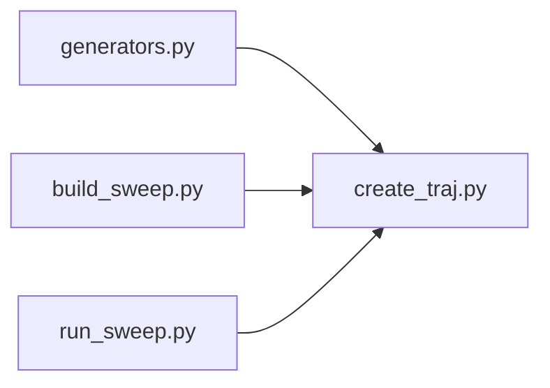
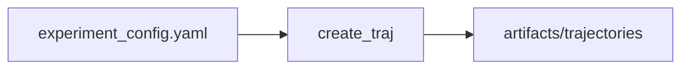

# Generation Step

This step handles the data generation step.

## Module Dependency

```mermaid
graph LR
    generators[generators.py] --> create_traj[create_traj.py]
    build_sweep[build_sweep.py] --> create_traj
    run_sweep[run_sweep.py] --> create_traj
```

## Data Flow

```mermaid
graph LR
    exp_conf[experiment_config.yaml] --> create_traj[create_traj]
    create_traj --> out_root[artifacts/trajectories]
```
